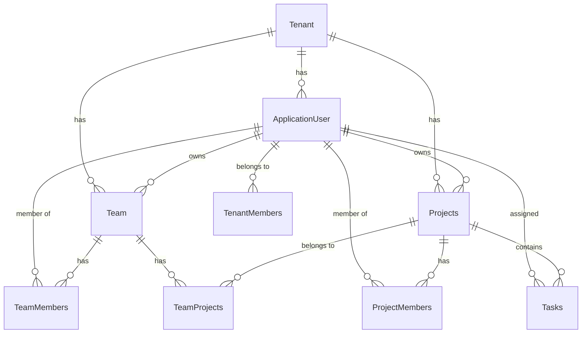

# TaskManament

## Sql Schema

```mermaid
erDiagram
    Tenant ||--o{ ApplicationUser : "has"
    Tenant ||--o{ Team : "has"
    Tenant ||--o{ Projects : "has"
    
    ApplicationUser ||--o{ TenantMembers : "belongs to"
    ApplicationUser ||--o{ Team : "owns"
    ApplicationUser ||--o{ TeamMembers : "member of"
    ApplicationUser ||--o{ Projects : "owns"
    ApplicationUser ||--o{ ProjectMembers : "member of"
    ApplicationUser ||--o{ Tasks : "assigned"
    
    Team ||--o{ TeamMembers : "has"
    Team ||--o{ TeamProjects : "has"
    
    Projects ||--o{ ProjectMembers : "has"
    Projects ||--o{ Tasks : "contains"
    Projects ||--o{ TeamProjects : "belongs to"
```
